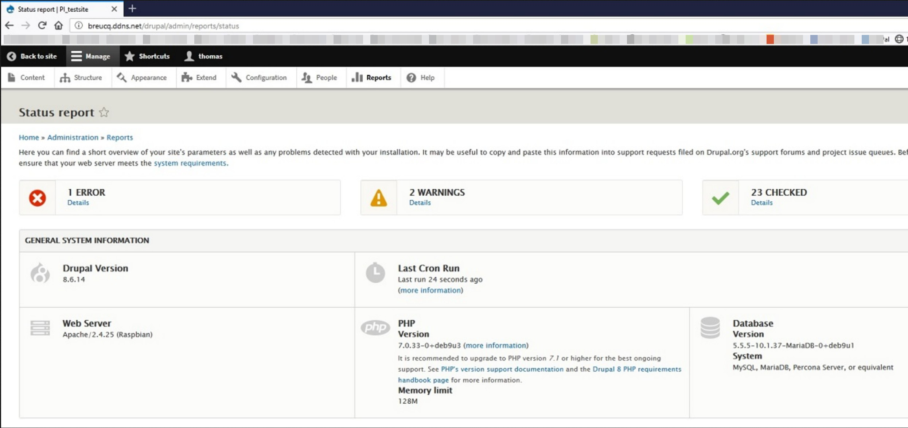

# Geautomatiseerde webserver op een raspberry PI

## Inleiding:

Deeltaak 2 van Projecten II bestaat uit het volledig automatiseren van een webserver opstelling, typisch wordt dit met Vagrant gedaan. Ik had het idee om de provisioning scripts uit deze taak toe te passen op een Rapsberry PI om een persoonlijke webserver op te zetten. Een extra hierbij is de service van www.noip.com om een hostnaam op te zetten en om het probleem van een wijzigend publiek ip van een thuisrouter te omzeilen. Dit alles geeft een volledig functionele webserver voor een prijskaartje van onder 50 EUR, dat is niet te overzien.

## Voorbereiding (no-ip en port forwarding):

In mijn geval (isp is Proximus) moesten volgende zaken geconfigureerd worden:
- Een account en hostname aanmaken op www.noip.com (vb, mijn keuze -> breucq.ddns.net)
- De no-ip service in de router instellen (router config typisch gezien bereikwaar adhv 192.168.1.1 in webbrowser)
- Ook op de router port forwarding instellen voor poorten 80 en 443
- Voor het gemak een statisch ip adres toekennen aan de raspberry pi, nogmaals in de router config.
- In de myproximus.be account de optie zoeken en activeren om poorten 80, 443 en 25 bruikbaar te maken. Deze worden standaard nogal vaak geblokkeerd.

Eens bovenstaande stappen (of gelijkardige igv een andere isp) doorlopen zijn zal onze raspberry pi later via het publieke internet bereikbaar zijn.

## PI scripting:

De originele scripts waren bedoeld voor gebruik met een CentOS distributie, de raspberry pi werkt het best op Raspbian (debian gebaseerd) dus op z'n minst waren wijzigingen nodig in de pakket manager. Ook wordt in raspbian gewerkt met apache2 ipv apache. Dit bracht ook enkele nodige wijzigingen mee.

Een klein overzicht van wat de scripts verwezelijken:
1. nodige packages voor de LAMP (Linux Apache Mysql PHP) stack installeren
2. Een databank aanmaken voor gebruik met de webapplicatie
3. Een gekozen webapplicatie downloaden.
4. Via een command line tool voor deze webapplicatie de eigenlijke installatie automatiseren.
5. Lichte config wijzigingen.

De scripts maken het dus mogelijk om via kleine variabele aanpassingen een webapplicatie volledig automatisch te installeren.  
Ze zijn [hier](/pad/naar/scripts) te bekijken indien interesse.
## Stappen voor opzet webserver:

1. Wijzig de aangewezen variabelen in `provissioning/srv001-PI.sh` naar voorkeur. Het is onder andere mogelijk de gebruikersnaam, gebruikerswachtwoord en sitenaam te wijzigen, maar de belangrijkste variabele is `app_module`. Deze bepaald welke webapplicatie effectief geinstalleerd zal worden.  
    Opties zijn:  
    * 'drupal'  
    * 'wordpress'
2. Download en schrijf raspbian naar een micro sd kaart met een image schrijfprogramma naar keuze (bv, Rufus)
3. Maak een bestand 'ssh' aan op de boot partitie, dit laat de nodige ssh verbinding toe.
4. Drop de map `provisioning`, die de nodige scripts bevat ook in de boot partitie.
5. Hang de raspberry pi ergens in het thuisnetwerk met een ethernetkabel en stroomvoorziening, start de pi.
6. De laatste stap: ssh naar de pi via het statisch ingestelde ip adres uit deel 'Voorbereiding' en voer uit:
```bash
sudo /boot/provisioning/srv001-PI.sh
```

Klaar! De installatie wordt automatisch doorlopen. In mijn geval is de pi nu publiek bereikbaar op breucq.ddns.net/drupal (of wordpress).




